# Banking

The samples shown here represent an evolution of a set of classes that relate to banking.

## Evolution of the Account Class

The simple `Account` class was used to illustrate the concept of encapsulation (private fields with public properties), but with one of the fields being read-only. This necessitates the presence of a constructor. This example includes a driver which shows that an object based on this class is in a "known state" as soon as it is created.

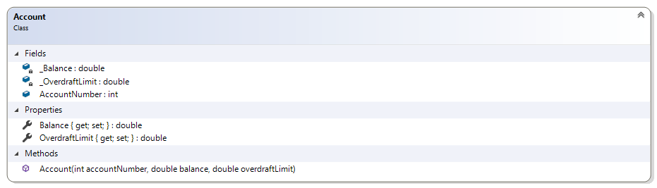

In the accompanying project, the `Account` class and its `DemoDriver` have been provided for you. The code for these classes is as follows.

```csharp
public class Account
{
    public readonly int AccountNumber;
    private double _Balance;
    private double _OverdraftLimit;

    public double Balance
    {
        get { return _Balance; }
        set { _Balance = value; }
    }

    public double OverdraftLimit
    {
        get { return _OverdraftLimit; }
        set { _OverdraftLimit = value; }
    }

    public Account(int accountNumber, double balance, double overdraftLimit)
    {
        AccountNumber = accountNumber;
        Balance = balance;
        OverdraftLimit = overdraftLimit;
    }
}
```

```csharp
public class DemoDriver
{
    public static void Main(string[] args)
    {
        Account savings = new Account(7654321, 100, 200);
        Console.WriteLine($"Account # {savings.AccountNumber} has a balance of ${savings.Balance}");
    }
}
```

----

## Topic D - Debugging

Extra information has been required for the `Account` class. As a result, new properties and an updated constructor is required.

Modify the Account class to include the following additional properties.

```csharp
public string AccountType { get; }
public string BankName { get; }
public int BranchNumber { get; }
public int InstitutionNumber { get; }
```

Then, change the constructor to match the following.

```csharp
public Account(string bankName, int branchNumber, int institutionNumber, int accountNumber, double balance, double overdraftLimit, string accountType)
{
    BankName = bankName;
    BranchNumber = branchNumber;
    InstitutionNumber = institutionNumber;
    AccountNumber = accountNumber;
    Balance = balance;
    OverdraftLimit = overdraftLimit;
    AccountType = accountType;
}
```

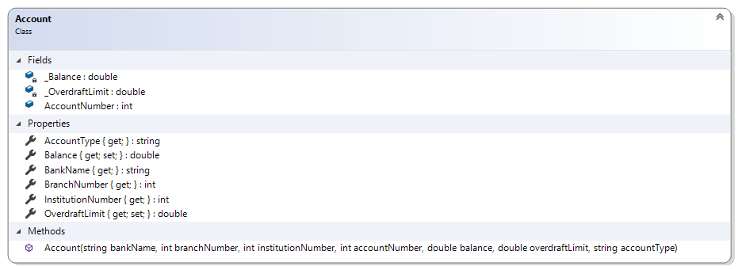

> *Note that the modification of the existing constructor introduces a **breaking change**. That is, because the constructor has changed, you will need to modify the Banking's `DemoDriver` class to use the new constructor.*

> TODO: Add an additional driver that will
>
> - [ ] read/write accounts to a JSON file
> - [ ] demonstrate the need for debugging

----

## Topic E – Expressions and Math

This class illustrates simple addition and calculation by allowing deposits and withdrawals. Note that changes to the balance can now only be made through deposits and withdrawals; the setter for the `Balance` must now be set to private.

```csharp
    public double Balance
    {
        get { return _Balance; }
        private set { _Balance = value; }
    }
```

### Problem Statement

Write the code that will represent a simple bank account.

The solution must meet the following requirements (new requirements are in bold):

- Should get the bank name, branch number, institution number, account number, balance, overdraft limit, and account type
- Should allow the overdraft limit to be set
- **Should support deposits and withdrawals**

As such, the following two methods need to be added to the `Account` class.

```csharp
public void Withdraw(double amount)
{
    Balance -= amount;
}

public void Deposit(double amount)
{
    Balance += amount;
}
```

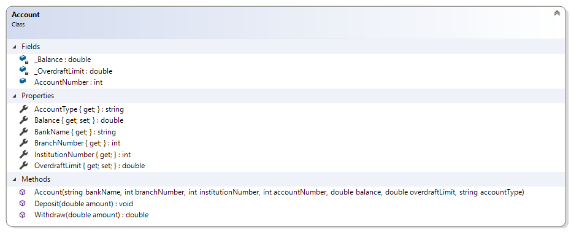

----

## Topic F – If-Else Structures

This class illustrates simple if structure in handling withdrawals; withdrawals are only made when the amount does not exceed the balance and the overdraft. It also identifies if the account is overdrawn.

### Problem Statement

Write the code that will represent a simple bank account. The solution must meet the following requirements (new requirements are in bold):

- Should get the bank name, branch number, institution number, account number, balance, overdraft limit, and account type and allow the overdraft limit to be set
- Should support deposits
- **Should only support withdrawals if the amount does not exceed the sum of the balance and the overdraft limit**
- **Should identify if the account is overdrawn**

The `Withdraw()` function needs rework to ensure that the withdrawal does not cause the account to go beyond the overdraft limit for the account.

```csharp
public double Withdraw(double amount)
{
    if (amount <= Balance + OverdraftLimit)
        Balance = Balance - amount;
    else
        amount = 0;
    return amount;
}
```

In order to simplify the use of `Account` objects in other parts of the program, a boolean property `IsOverdrawn` is being introduced. An account is overdrawn if the balance is less than zero.

```csharp
public bool IsOverdrawn
{
    get
    {
        bool overdrawn;
        if (Balance < 0)
            overdrawn = true;
        else
            overdrawn = false;
        return overdrawn;
    }
}
```

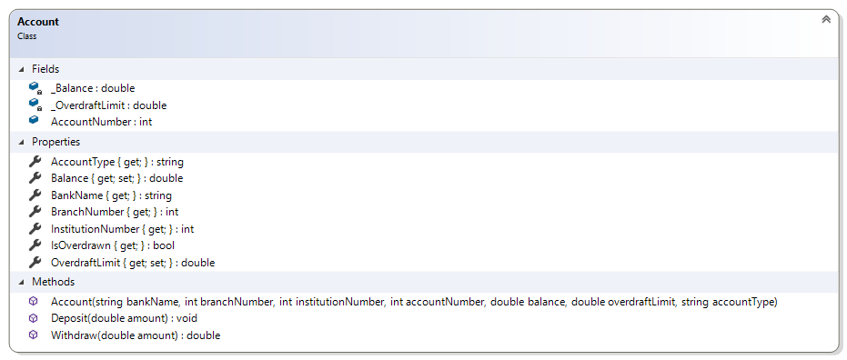

----

## Topic G – Raising Exceptions

The following account information is now verified when the class is created:

1. Bank name and account type cannot be empty
1. The opening balance must be greater than zero
1. The overdraft limit cannot be negative
1. The institution number must be 3 digits
1. The branch number must be 6 digits
1. Attempts to withdraw amounts beyond the overdraft limit should throw an "Insufficient Funds" exception

### Problem Statement

Write the code that will add validation to the Account class. The solution must meet the following requirements (new requirements are in bold):

- Should get the bank name, branch number, institution number, account number, balance, overdraft limit, and account type and allow the overdraft limit to be set
- Should support deposits
- Should only support withdrawals if the amount does not exceed the sum of the balance and the overdraft limit, **otherwise an exception stating "Insufficient Funds" should occur**
- Should identify if the account is overdrawn
- **Should require bank name and account type (that is, they cannot be empty or null)**
- **Should trim the bank name and account type**
- **Should verify that the branch number is six digits and the institution number is three digits**
- **Should require an opening balance**
- **Should not allow a negative overdraft limit**

In order to meet these requirements, the following changes need to be made to the `Account` class.

```csharp
public double Balance
{
    get { return _Balance; }
    set {
        if (value < -OverdraftLimit)
            throw new Exception("Negative balances cannot exceed the Overdraft Limit");
        _Balance = value;
    }
}

public double OverdraftLimit
{
    get { return _OverdraftLimit; }
    set
    {
        if (value < 0)
            throw new Exception("Negative overdraft limits not allowed");
        _OverdraftLimit = value;
    }
}

public double Withdraw(double amount)
{
    if (amount != Math.Round(amount, 2))
        throw new Exception("Withdrawal amounts cannot include fractions of a penny");
    if (amount > Balance + OverdraftLimit)
        throw new Exception("Insufficient Funds");
    if (amount <= Balance + OverdraftLimit)
        Balance = Math.Round(Balance - amount, 2);
    else
        amount = 0;
    return amount;
}

public void Deposit(double amount)
{
    if (amount != Math.Round(amount, 2))
        throw new Exception("Deposit amounts cannot include fractions of a penny");
    Balance = Math.Round(Balance + amount, 2);
}
```

Also, the constructor needs to be modified to include validation checks related to the initial state of the `Account` objects.

```csharp
// Ensuring a valid state
if (string.IsNullOrEmpty(bankName) || string.IsNullOrEmpty(bankName.Trim()))
    throw new Exception("BankName is required");
if (branchNumber < 10000 || branchNumber > 99999)
    throw new Exception("Branch number must be 5 digits");
if (institutionNumber < 100 || institutionNumber > 999)
    throw new Exception("InstitutionNumber must be a three-digit value");
if (balance <= 0)
    throw new Exception("Opening balance must be greater than zero");
if (balance != Math.Round(balance, 2))
    throw new Exception("Opening balances cannot include a fraction of a penny");
if (overdraftLimit != Math.Round(overdraftLimit, 2))
    throw new Exception("Overdraft limit amounts cannot include a fraction of a penny");
if (string.IsNullOrEmpty(accountType) || string.IsNullOrEmpty(accountType.Trim()))
    throw new Exception("Account type cannot be empty");
```


### Additional Requirements

A flaw has been discovered in the design. As such, the following new requirement has been added.

- **Should only allow positive, non-zero amounts when performing a deposit or withdrawal**

Implement this requirement on your own.

----

## Topic I – Enumerations and Composition

> TODO: Add descriptions
>
> - [ ] Intro enumeration
> - [ ] new requirements (testing)
> - [ ] Overloaded constructor
> - [ ] Enum to String with Humanizer
> - [ ] Bank Statement (without transactions)
> - [ ] Month

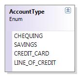

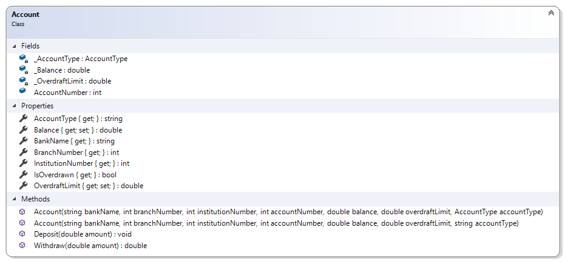

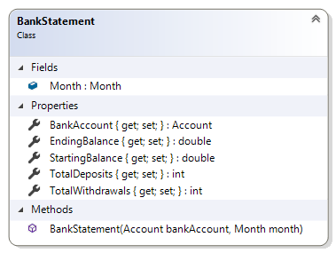

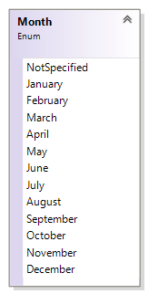

----

## Topic K - Looping and Collections

Here we introduce additional classes to represent a bank statement for a bank account for a given month. The `BankStatement` allows `BankTransaction` objects to be added, and performs deposits and withdrawals on the `BankAccount`. The statement reports the starting and ending balance and also summarizes the total amount deposited and withdrawn for the month. The following methods must be coded to complete the solution.

### The `BankTransaction` Record

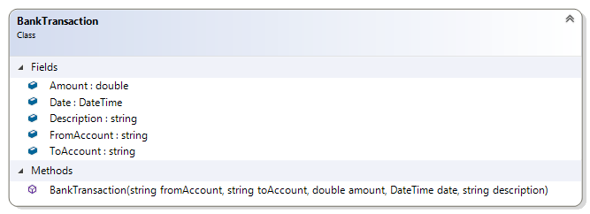

> ***New** in C#9* - The `record` keyword allows for the quick creation of an **immutable** class. It is the perfect choice for our `BankTransaction` because the transaction information should never change.

```csharp
    public record BankTransaction(double Amount, DateTime Date, string FromAccount, string ToAccount, string Description);
```

### `Account` Overrides `ToString()`

In order to simplify the comparison of `Account` objects to the `FromAccount` and `ToAccount` in the `BankTransaction`, we can override the `ToString()` method of the `Account` class to represent the full account number in this format.

```csharp
public override string ToString()
{
    return $"{InstitutionNumber}-{BranchNumber}-{AccountNumber}";
}
```

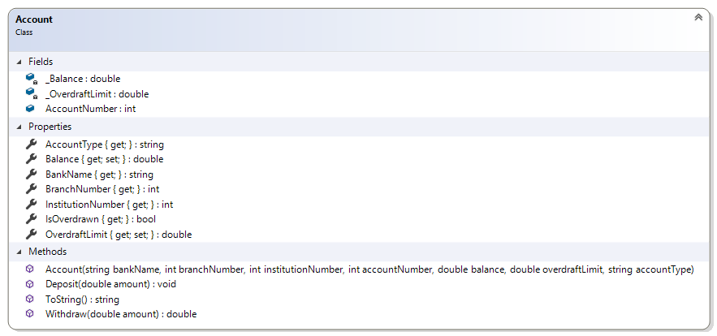

### `BankStatement` Modifications

With the new `BankTransaction`, we can maintain a list of these objects in our `BankStatement`. Further, in order to properly apply the transaction to the `BankAccount`, we will include an `Add()` method that will determine if the amount should be applied as a deposit or a withdrawal.

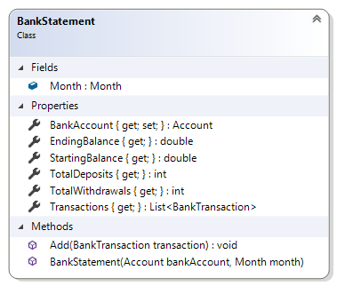

----

## Topic L - Arrays - Not Sorted

> TODO: Array Processing
>
> - [ ] Hard-code a list of `BankTransaction`
> - [ ] Filter for a specific `Account` number (perhaps sending it in as an argument to the driver)
> - [ ] Driver "flag/value" processing

----

## Topic M - Arrays - Sorted

> TODO: Introduce File I/O with a list of `BankTransaction` and apply some sorting to order these by Date
>
> - [ ] Simple Bubble Sort
> - [ ] Quick Sort

----

## Topic N - Modularization and Utility Classes

> TODO:
>
> - [ ] Modularize the Driver because it's growing in size
> - [ ] Modularize the user Input/Output
> - [ ] Generalize the Bubble Sort or other items (such as the **Swap**, using a Generic Method!)

----

## Topic O - File I/O

> TODO:
>
> - [ ] File I/O of `BankTransaction`
